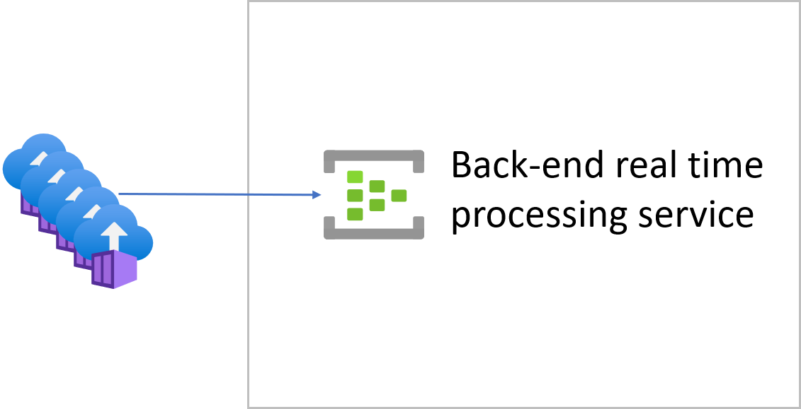

# Overview
This repo helps developers to generate load by scalable simulator for load test. It will create multiple Azure Container Instance and they will send load to target EventHub.
If you are interrsted in to learn load test, please refer [my blog post](https://masayukiota.medium.com/load-test-for-real-time-data-processing-30a256a994ce).

Do you want to automate back-end provisioning for load testing ? This [repo](https://github.com/NT-D/eh-func-iac) and blog posts ([post1](https://medium.com/swlh/consideration-scaling-out-azure-functions-with-event-hubs-effectively-5445cc616b01), [post2](https://masayukiota.medium.com/scaling-out-azure-functions-with-event-hubs-effectively-2-55d143e2b793)) helps you.

# Prerequisites
## Environment
This repo uses Terraform. I expect you to prepare your Terraform Environment from one of following methods.
- Use [Dev Container](https://code.visualstudio.com/docs/remote/containers). You can utilize dev container which I made for this repo.
- Install [Terraform CLI](https://www.terraform.io/docs/cli-index.html) and [Azure CLI](https://docs.microsoft.com/en-us/cli/azure/install-azure-cli)

## Basic knowledge
- Finished [Terraform tutorial](https://learn.hashicorp.com/collections/terraform/azure-get-started)
- Understand basic .NET Core App development

# Architecture

# How to run
1. Update `test.tfvars` file. 
  - Specify your unique `app_name`. Otherwise, Terraform may fail to provision because there are already same name resource in the world. 
  - Setup `region`. Please use nearest location from your Event Hub.
  - Update `number_of_instance`, `ConnectionString`, `EventHubName`, `NumberOfMessages` and `IntervalMiliSeconds`.
1. `cd terraform`
1. `terraform init`
1. `terraform plan -var-file="./env/test/test.tfvars"`
1. `terraform apply -var-file="./env/test/test.tfvars" -auto-approve`

It will provision multiple Azure Container Instances and send messages to your target Event Hubs.